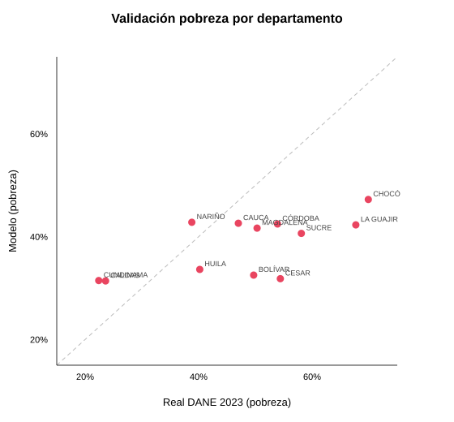

# Validación espacial — pobreza por departamento

Modelo (baseline 2026) vs DANE 2023, por departamento.

- Departamentos comparados: **12**
- Correlación de Pearson: **0.564**
- Correlación de Spearman (orden): **0.378**
- Error absoluto medio (MAE): **13.8 pp**
- Rango real: 22%–70%  ·  Rango modelo: 32%–48%

| Departamento | Real DANE | Modelo | Δ |
|---|---|---|---|
| CHOCÓ | 69.9% | 47.9% | -22.0 pp |
| LA GUAJIRA | 67.7% | 38.3% | -29.4 pp |
| SUCRE | 58.1% | 42.6% | -15.5 pp |
| CESAR | 54.4% | 31.6% | -22.8 pp |
| CÓRDOBA | 53.9% | 41.8% | -12.1 pp |
| MAGDALENA | 50.3% | 38.8% | -11.5 pp |
| BOLÍVAR | 49.7% | 32.1% | -17.6 pp |
| CAUCA | 47.0% | 40.4% | -6.6 pp |
| HUILA | 40.2% | 34.8% | -5.4 pp |
| NARIÑO | 38.8% | 44.0% | +5.2 pp |
| CALDAS | 23.6% | 32.3% | +8.7 pp |
| CUNDINAMARCA | 22.4% | 31.7% | +9.3 pp |

**Lectura:** una Spearman alta indica que el modelo ordena bien los departamentos (reproduce el patrón espacial); un MAE/rango menor que el real indica que el modelo **comprime** la desigualdad espacial (driver estructural regional aún por calibrar más allá de educación rural y conflicto).

