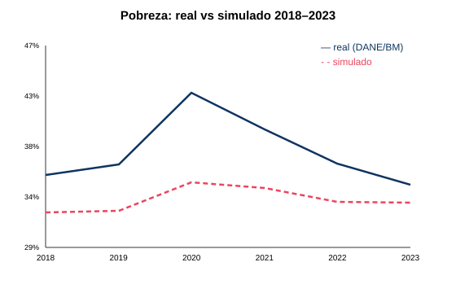
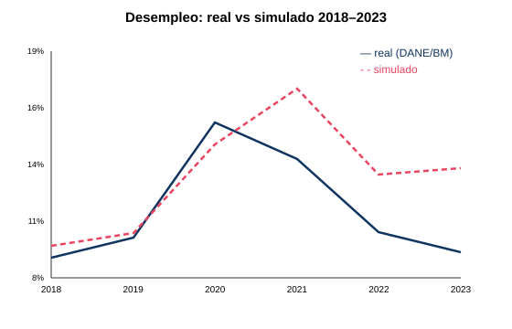

# Validación fuera de muestra 2018–2023 (shock COVID-2020 mag=0.15)

Modelo iniciado en 2018, corrido a 2023 con un shock exógeno en 2020 (la pandemia no es endógena a ningún modelo). Comparado con la serie real (Banco Mundial/DANE).

| Indicador | MAE | MAE sin sesgo (forma) |
|---|---|---|
| Pobreza | 4.4 pp | 1.6 pp |
| Desempleo | 1.9 pp | 1.7 pp |
| Gini | 2.8 pp | 0.9 pp |

**Lectura:** el MAE sin sesgo mide si el modelo reproduce la **forma** (caída por COVID y recuperación). Un sesgo constante refleja la diferencia de nivel entre nuestra calibración (~32%) y la cifra revisada de pobreza (BM 34.6%). El modelo capta niveles y la dirección del shock; la magnitud del pico de pobreza queda amortiguada (colchón de ingreso no laboral) y la recuperación del empleo es lenta (ciclo de primer orden) — a mejorar en Tier 2 (colchón de fuerza laboral, dinámica de recuperación).

